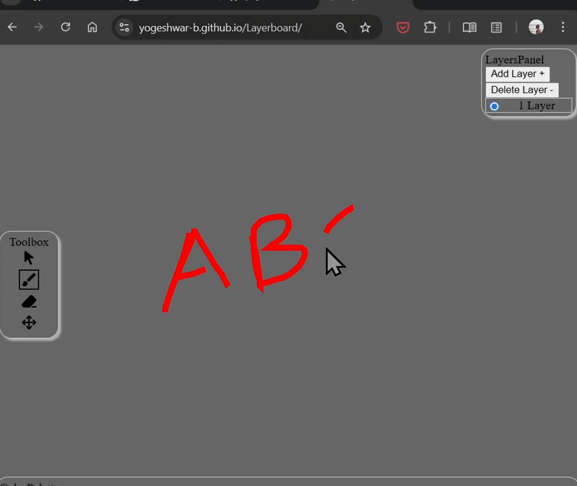
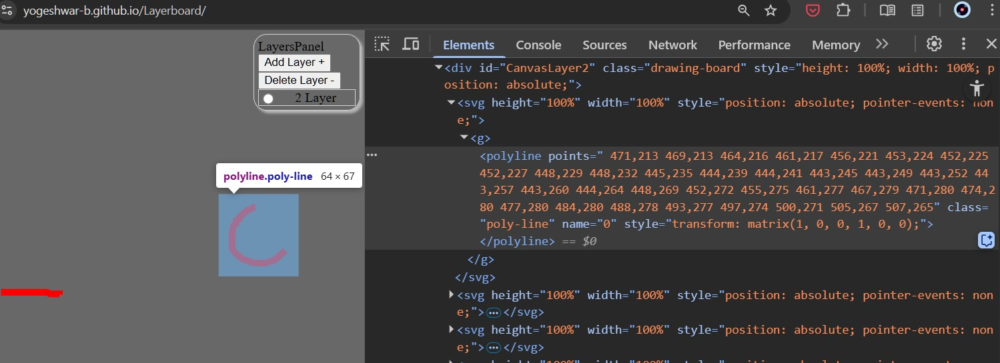

# LayerBoard

A Whiteboard application that supports Layers.

## 🚧WORK IN PROGRESS🚧
### Try at your own Risk 👆 https://yogeshwar-b.github.io/Layerboard/

The Soul of the application is in storing the Drawing as a Polyline vector. This opens up limit less possibilities to work with the drawing in the Code and scaling.

