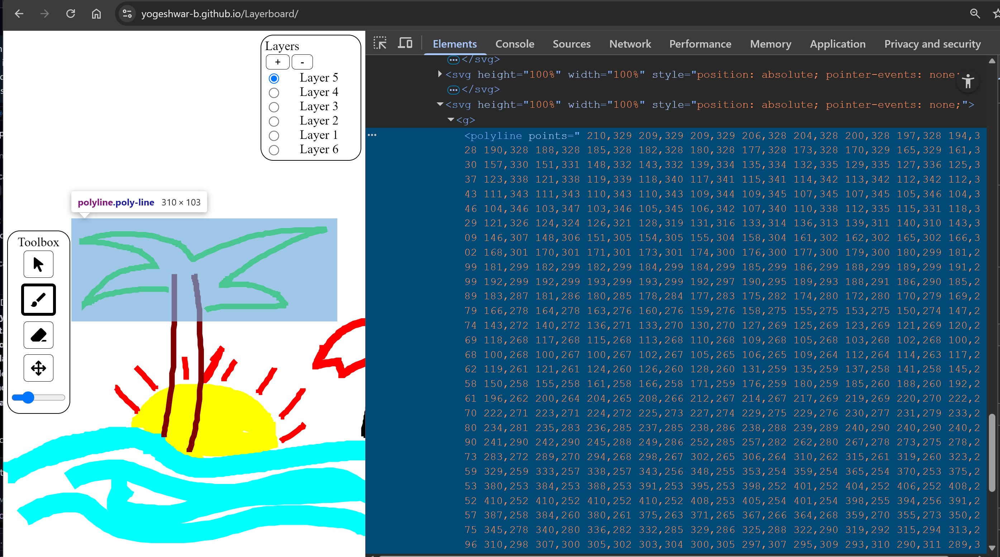

# LayerBoard

A Ground Up Implmentation of Whiteboard application with Vector Grpahics that supports Layers.

## 🚧WORK IN PROGRESS🚧

### Try at your own Risk 👆 https://yogeshwar-b.github.io/Layerboard/

## Layers Shuffle Adjustment

## Vector Data of each stroke

The Soul of the application is in storing the Drawing as a Polyline vector. This opens up limit less possibilities to work with the drawing in the Code and scaling.

